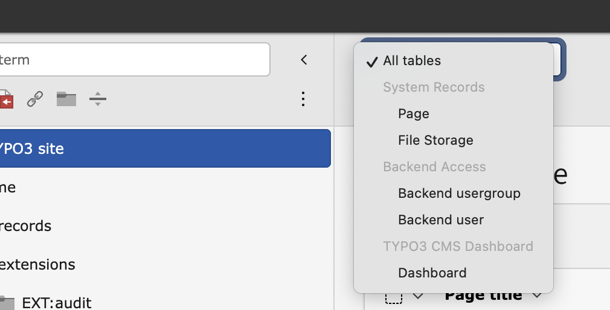
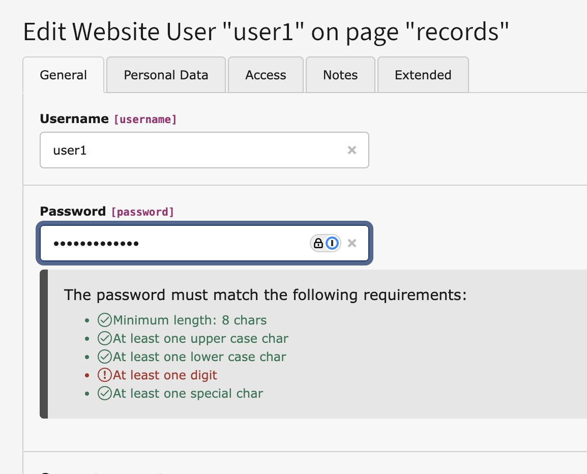

# TYPO3 Extension `invero`

## Usage

Just install the extension.

Supported TYPO3 Versions: 14-dev, 13.4 LTS, 12.4 LTS

## Features

This extension contains some of those missing pieces in TYPO3 backend.

- Bulk editing
- Record selector in toolbar
- Translated page tree
- Password meter for the backend

### Bulk editing

You want to hide multiple records with 2 clicks or define the categories of 10 news records in seconds?

[bulk.mp4](Resources/Public/Screenshots/bulk.mp4)

Now it is possible!

### Record selector in the toolbar

Avoid endless scrolling to find the table with the records you and your editors want to edit!

Just select the table name in the toolbar and you are don!

[record-selector.mp4](Resources/Public/Screenshots/record-selector.mp4)

### Translated page tree

See the page tree in any translation.

[multilanguage-tree.mp4](Resources/Public/Screenshots/multilanguage-tree.mp4)

### Password meter for the backend

Finally you see which password requirements are met - before submitting the password and getting an error after saving.

[password.mp4](Resources/Public/Screenshots/password.mp4)
